## Part 1. Установка ОС

##### Установить **Ubuntu 20.04 Server LTS** без графического интерфейса. (Используем программу для виртуализации - VirtualBox)

- Графический интерфейс должен отсутствовать.

- Узнайте версию Ubuntu, выполнив команду \
`cat /etc/issue.`
- Вставьте скриншот с выводом команды:

## Part 2. Создание пользователя

- создание пользователя происходит с помощью команды: 
`sudo adduser <имя нового пользователя>`
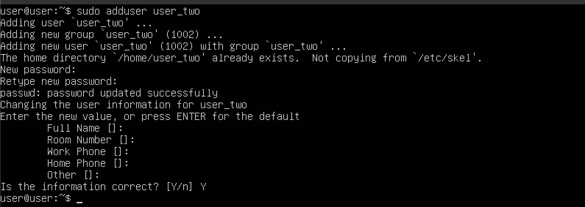

- в результате вывода команды `cat /etc/passwd` можно увидеть нового пользователя:
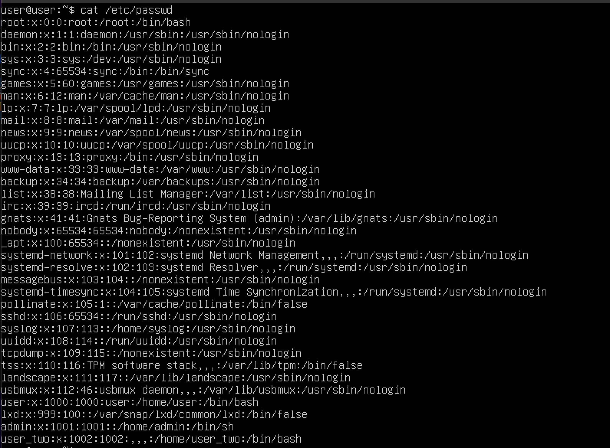

- далее добавляем пользователя в группу adm с помощью команды `sudo usermod -a -G adm`:
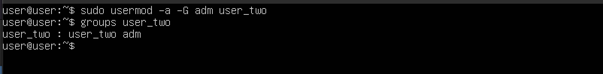

## Part 3. Настройка сети ОС

- изначально название машины было "user":

- командой `sudo hostname user-1` поменяли название и проверили:

- устанавливаем временную зону, которая соответствует моему местоположению командой `sudo timedatectl set-timezone Asia/Novosibirsk` предварительно узнав корректное название зоны
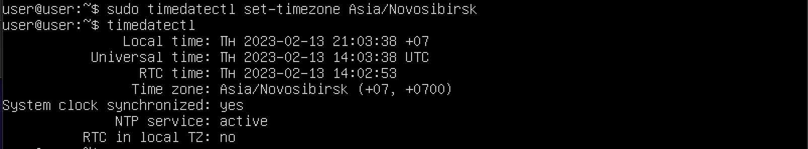

- командой `ifconfig` выводим названия наших сетевых интерфейсов:
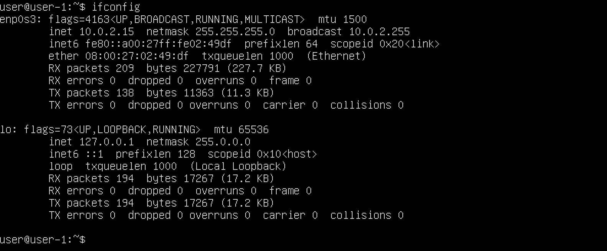

- интерфейс lo нужен для того чтобы отлаживать сетевые программы и запускать серверные приложения на локальном компьютере без подключения внешней сети. К интерфейсу привязан адрес 127.0.0.1
- ip адрес устройства на котором я работаю можно узнать с помощью команды `hostname -I`
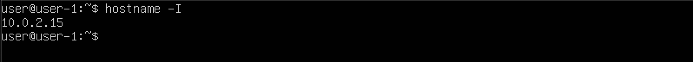

- >DHCP — сетевой протокол, позволяющий сетевым устройствам автоматически получать IP-адрес и другие параметры, необходимые для работы в сети TCP/IP. Данный протокол работает по модели «клиент-сервер».

- Выведем на экран внутренний IP-адрес шлюза и внешний ip-адрес шлюза (ip)  с помощью команд `curl ifconfig.me` и `ip route` соответственно
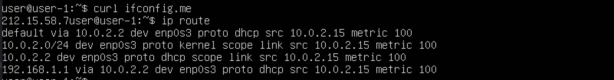

- Зададим статичные настройки ip, gw и dns. Для этого я использовал редактор vim и команду `sudo vim /etc/netplan/00-installer-config.yaml`
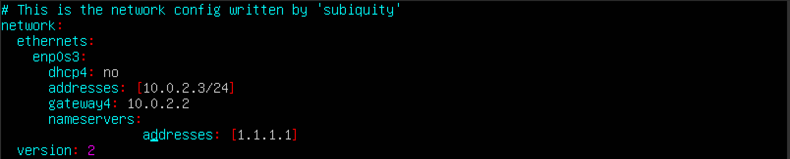

  - addresses — ip адрес который будет назначен нашей сетевой карте.
  - gateway4 — ip адрес нашего роутера.
  - nameservers — адрес DNS сервера.

- перезагружаем машину и убеждаемся что статичные сетевые настройки (ip, gw, dns) соответствуют заданным в предыдущем пункте
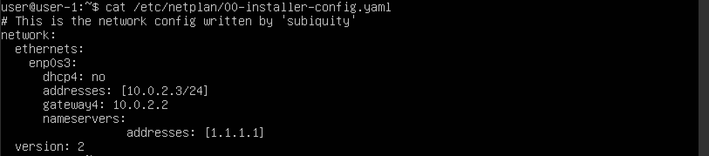
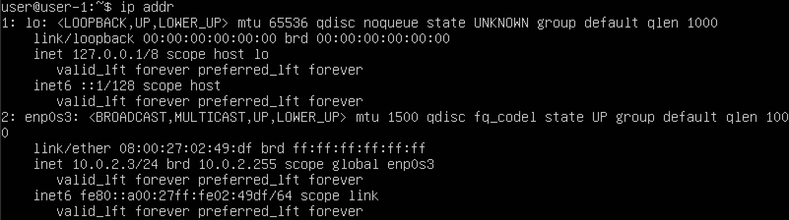

- далее пингуем адрес 1.1.1.1 и получаем сообщение "0% packet loss"
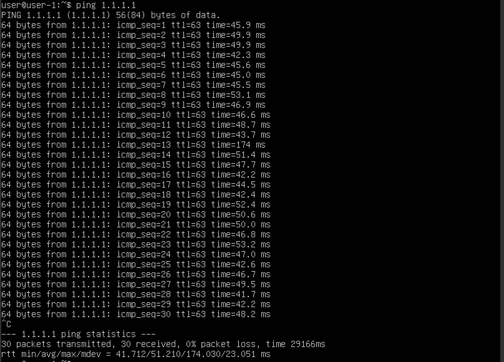

- также пингуем адрес ya.ru и получаем то же сообщение:
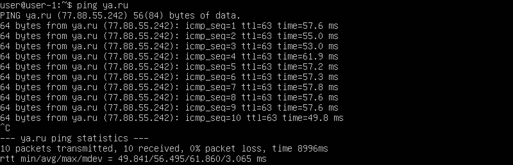

## Part 4. Обновление ОС

- Проверяем наличие обновлений командой `sudo apt update`:
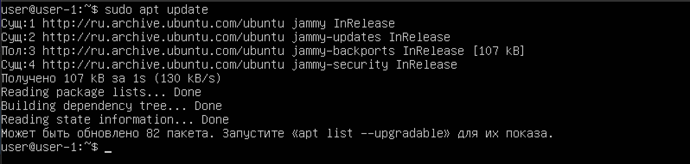

- Далее командой `sudo apt upgrade` обновлем пакеты:
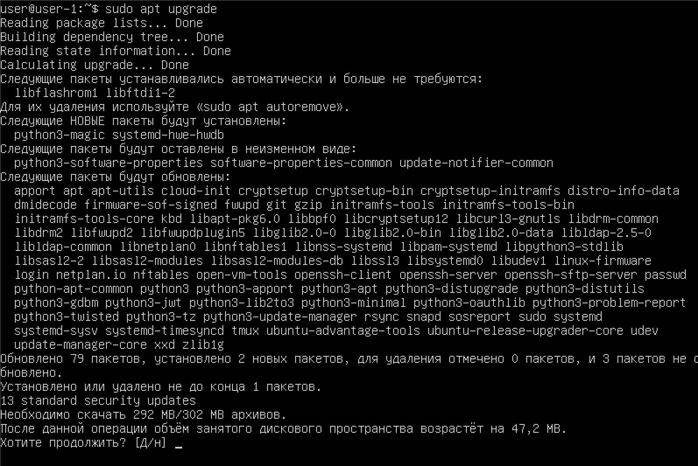

- Убеждаемся что все пакеты обновлены:
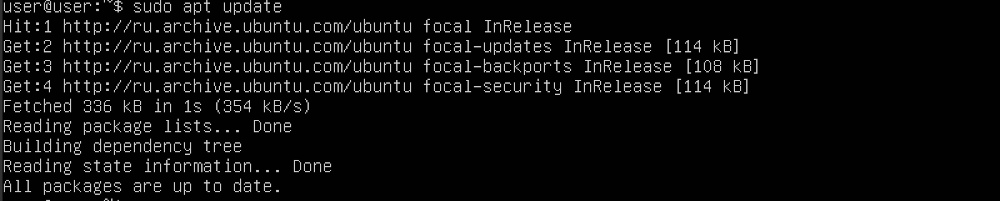

## Part 5. Использование команды **sudo**

- Разрешаем пользователю user_two, созданному в Part 2, выполнять команду sudo:

- >Команда sudo предоставляет возможность пользователям выполнять команды от имени суперпользователя root, либо других пользователей.

- Поменяем hostname ОС от имени пользователя, созданного в  Part 2 (используя sudo). Сначала перезайдем под пользователем user_two (`su - user_two`) и командой `sudo hostnamectl set-hostname user_two-1` поменяем имя хоста:
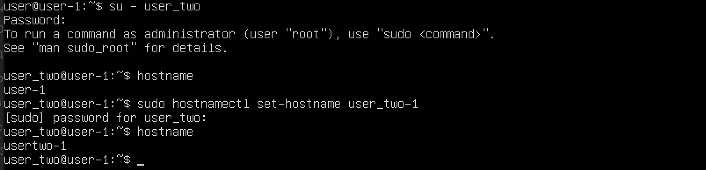

- перезапустим машину и убедимся в том что имя изменено:

## Part 6. Установка и настройка службы времени

- Выведем время и часовой пояс в котором мы находимся, командами `date` и `cat /etc/timezone`:
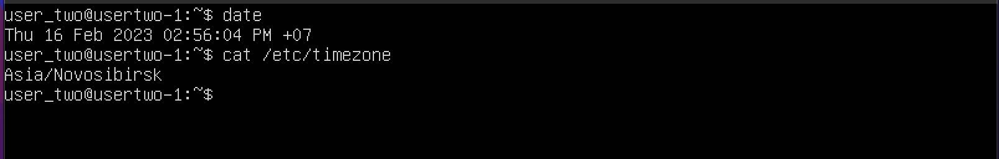

- Вывод следующей команды содержит `NTPSynchronized=yes`: \
  `timedatectl show`
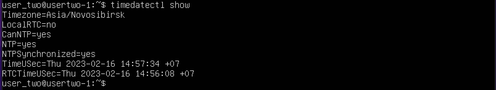

- Командой `timedatectl set-ntp on` настроим службу автоматической синхронизации времени:
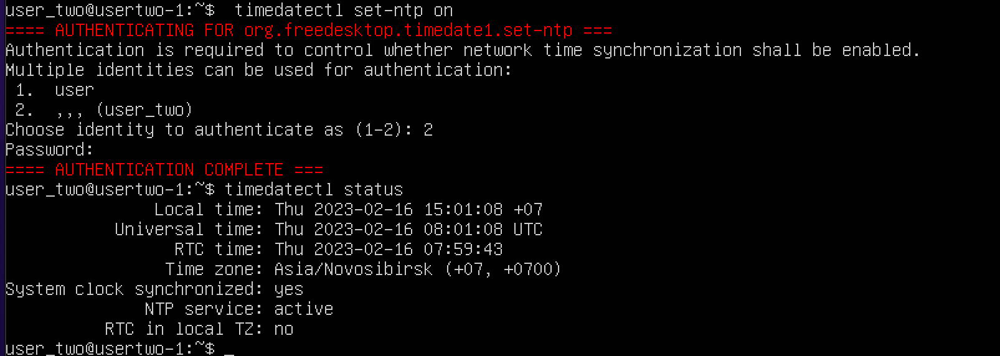

## Part 7. Установка и использование текстовых редакторов 

- Используя редакторы vim,nano и joe, отредактируем файл *test_X.txt*, где X -- название редактора. Напишем в нём свой никнейм, закроем файл с сохранением изменений. 
  
  - Чтобы сохранить файл и выйти из редактора vim, нажмем Esc чтобы переключиться в обычный режим, введем :wq и нажмем Enter:

  - Для сохранения и выхода из nano нажмем CTRL + O и нажмем ENTER, чтобы сохранить изменения, далее чтобы выйти из nano, достаточно нажать CTRL + X.
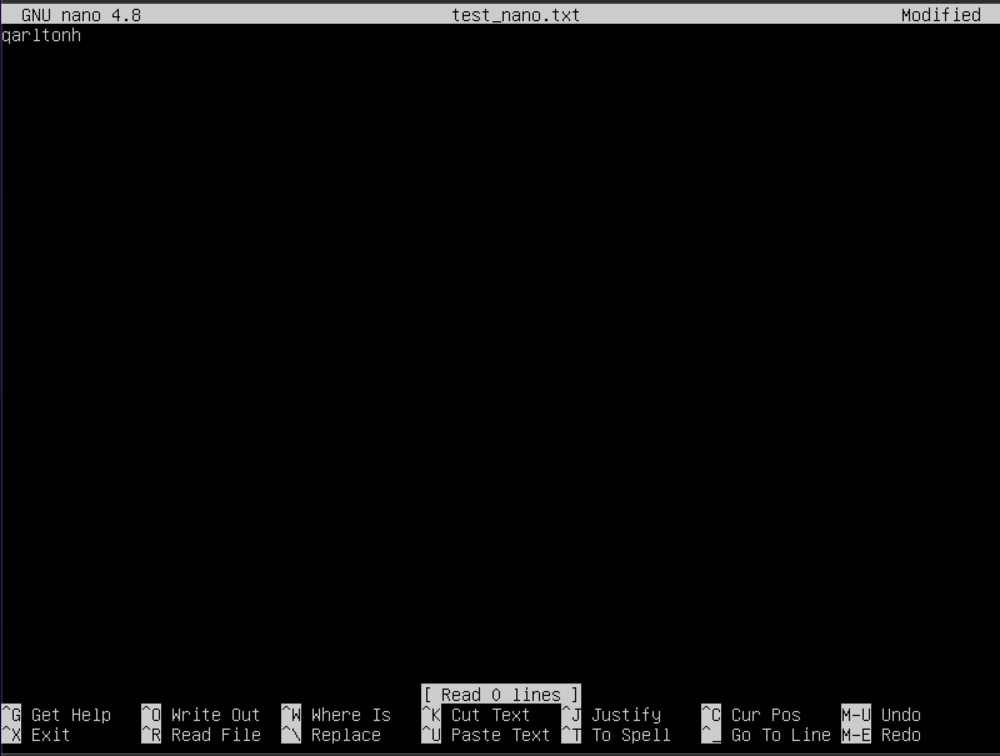

  - Чтобы сохранить файл и выйти из редактора joe, нужно использовать Ctrl+K, а затем клавишу X.

- Используя каждый из трех выбранных редакторов, откроем файл на редактирование, отредактируйем файл, заменив никнейм на строку "21 School 21" и закроем файл без сохранения изменений.
  - Чтобы выйти из редактора vim без сохранения, нажмем Esc чтобы переключиться в обычный режим, введем :qa! и нажмем Enter:

  - Для выхода из nano, достаточно нажать CTRL + X.
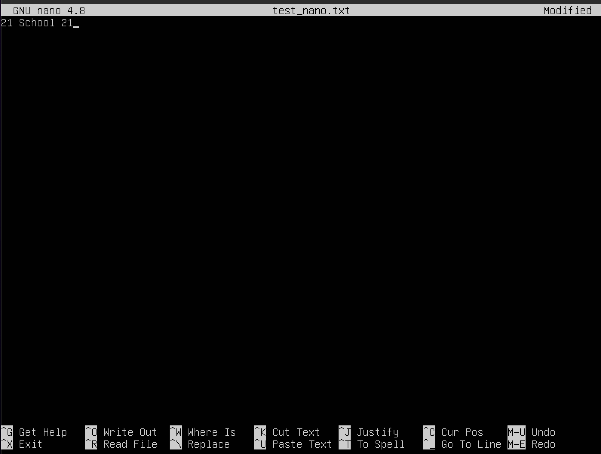

  - Чтобы  выйти из редактора joe без сохранения нужно использовать комбинацию Ctrl+С.
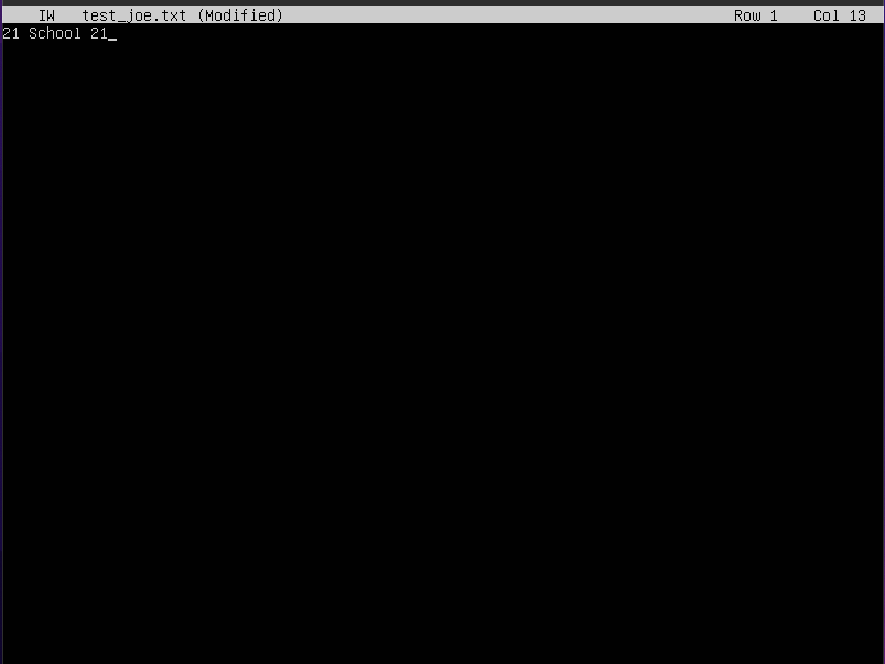

- Используя каждый из трех выбранных редакторов, отредактируем файл ещё раз (по аналогии с предыдущим пунктом), а затем освоим функции поиска по содержимому файла (слово) и замены слова на любое другое.

  - В vim для поиска и замены вводим команду `%s/\School\>/qarltonh/g` где School - искомое, а qarltonh заменяемое.
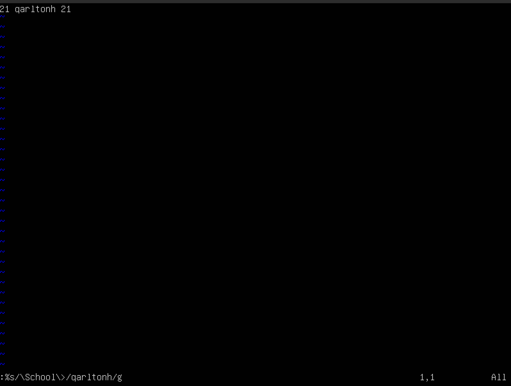

  - В nano для поиска и замены нажмем Ctrl+\\, введем строку, которую необходимо искать ( School ) и нажмите клавишу Enter. Затем введем строку, на которую произвести замену ( qarltonh ) и нажмем Enter
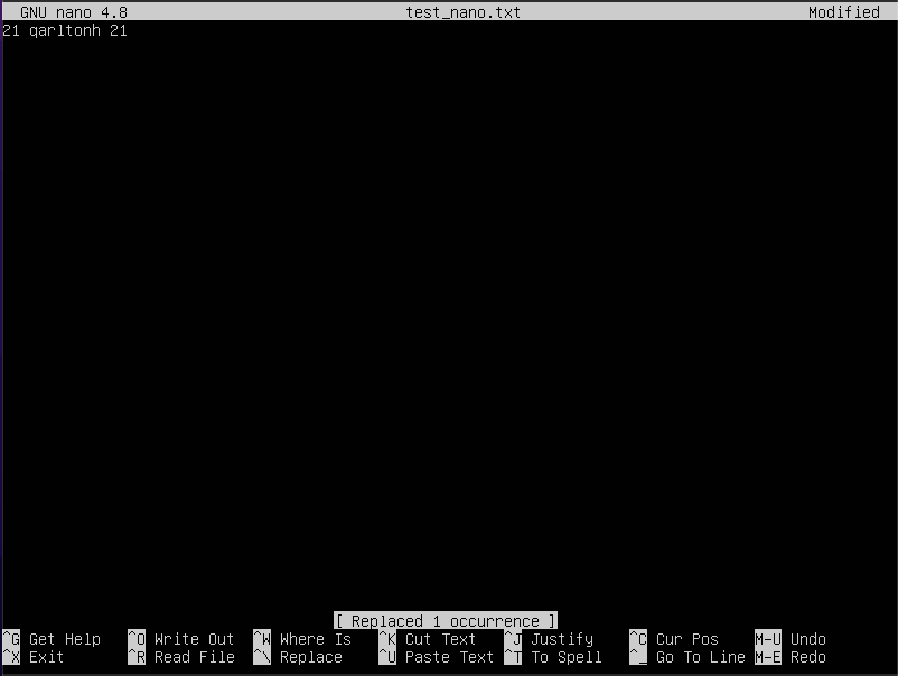

  - В joe для поиска вхождения нажимаем Ctrl+K затем f, после вводим School (искомое) и ENTER подтверждаем замену r, вводим qarltonh(замена) и подтверждаем y.
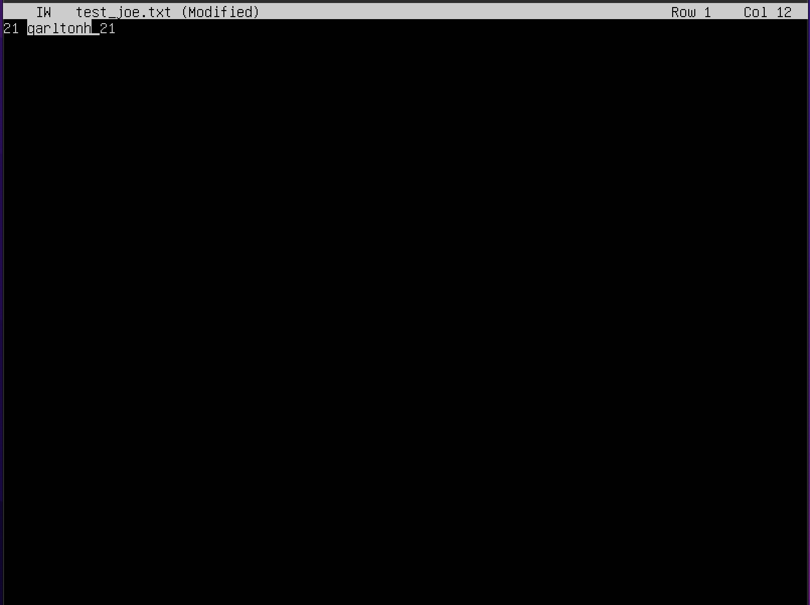

## Part 8. Установка и базовая настройка сервиса **SSHD**

- Установим службу SSHd.
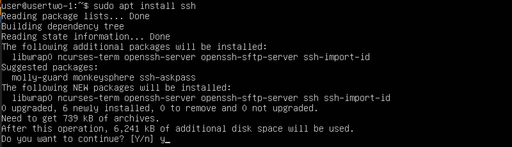

- Проверим работу службу SSHd.
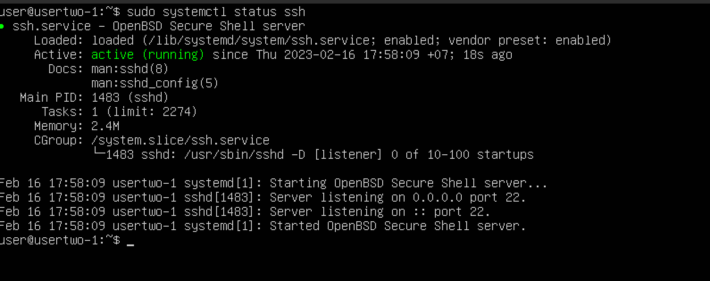

- Добавим автостарт службы при загрузке системы.
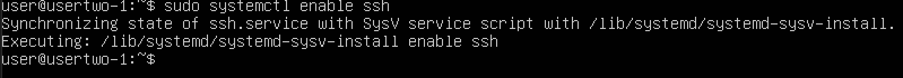

- Перенастроим службу SSHd на порт 2022. Для этого внесем изменнения в файл /etc/ssh/sshd_config
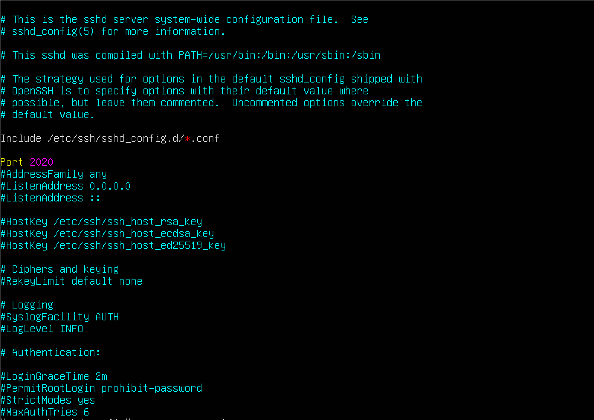

- Используя команду ps, покажем наличие процесса sshd. Для этого к команде нужно подобрать ключи.
  -  ps Выводит процессы, выполняющиеся в настоящее время от имени пользователя
  - Флаги:
    - aux Выводятся все процессы, выполняющиеся от имени всех пользователей (выводит статистику, время старта процесса и команду, которая его стартовала);
    - -e Все выполняющиеся процессы в системе;
    - -A, -e, (a) - выбрать все процессы;
    - -a - выбрать все процессы, кроме фоновых;
    - o	-d, (g) - выбрать все процессы, даже фоновые, кроме процессов сессий;
    - -N - выбрать все процессы кроме указанных;
    - -С - выбирать процессы по имени команды;
    - -G - выбрать процессы по ID группы;
    - -p, (p) - выбрать процессы PID;
    - --ppid - выбрать процессы по PID родительского процесса;
    - -s - выбрать процессы по ID сессии;
    - -t, (t) - выбрать процессы по tty;
    - -u, (U) - выбрать процессы пользователя.

- Выведем результат команды `ps aux | grep [s]sh`
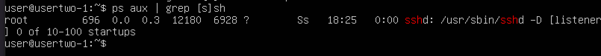

- Проверим работу службу SSHd после перезагрузки:
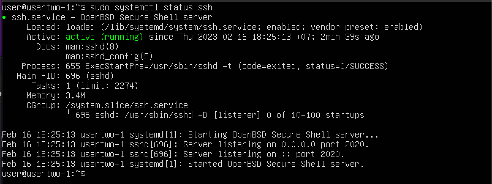

- Вывод команды `netstat -tan` должен содержать  \
`tcp 0 0 0.0.0.0:2022 0.0.0.0:* LISTEN`:
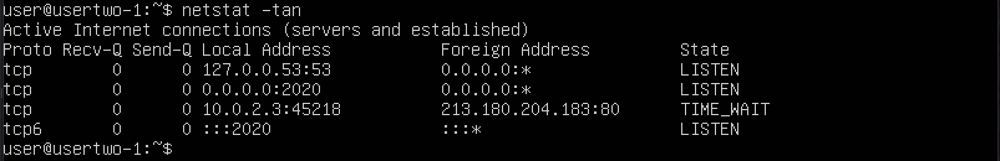

- Ключи команды netstat:
        - -t - протокол обмена данными для отчёта, tcp в этом случае
        - -a - отображение всех подключений и ожидающих портов
        - -n - отображение IP-адресов и номеров портов в цифровом виде
    - Proto - используемый протокол обмена данными, по ключу -t выбран tcp 
    - Recv-Q - количество байт, не скопированных программой пользователя, подключенной к этому сокету(это данные которые приняты хостом и ожидающие обработки программой).
    - Send-Q - Количество байт, не подтвержденных удаленным хостом.
    - Local Address - адрес и номер порта локального конца сокета.
    - Foreing Address - адрес и номер порта удаленного конца сокета.
    - State - состояние сокета TCP (LISTEN - ожидает входящих соединения, т.е. открыт).
    - IP-адрес 0.0.0.0 может использоваться на серверах для обозначения того, что служба может связываться со всеми сетевыми интерфейсами. Он дает команду серверу «прослушивать» и принимать соединения с любого IP-адреса.

## Part 9. Установка и использование утилит **top**, **htop**

- Запустим утилиту top
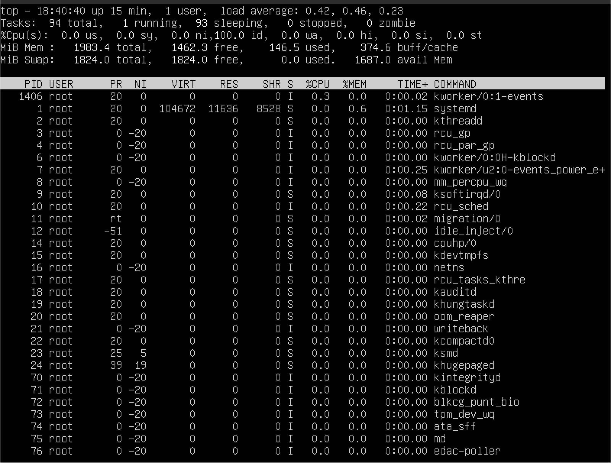
    - uptime: `18:40:40 up 15 min`
    - количество авторизованных пользователей: `1 user`
    - общая загрузка системы: `load average 0.42, 0.46, 0.23 `
    - общее количество процессов: `94 total`
    - загрузка cpu: `%Cpu(s): 0.0 us, 0.0 sy 0.0 ni, 100.0 id, 0.0 wa, 0.0 hi, 0.0 si, 0.0 st`
    - загрузка памяти: `MiB Mem: 1983.4 total, 1462.3 free, 146.5 used, 374.6 buuf/cache`
    - pid процесса занимающего больше всего памяти:
    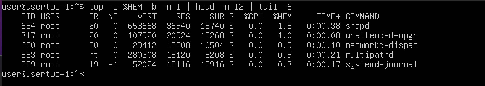
    - pid процесса, занимающего больше всего процессорного времени:
    

- Вывод команды `htop`:
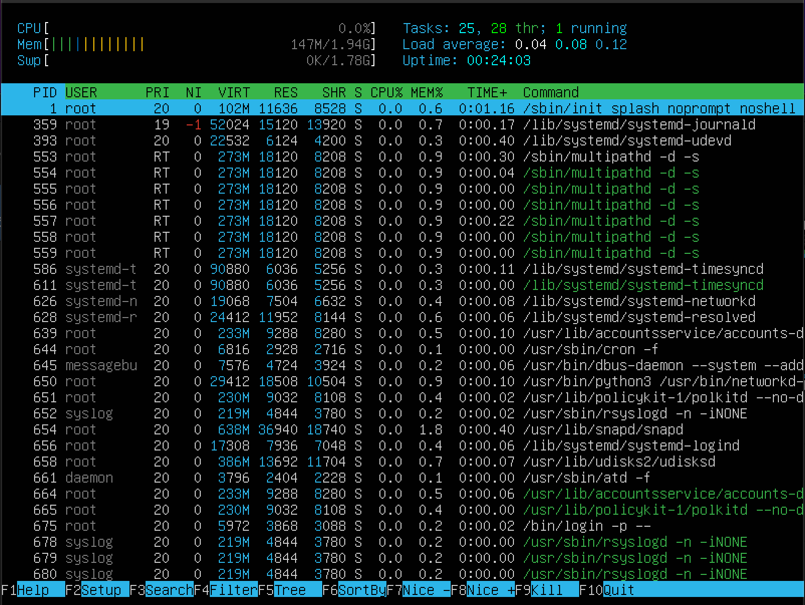
  - отсортированное по PID:

  - отсортированное по PERCENT_CPU:
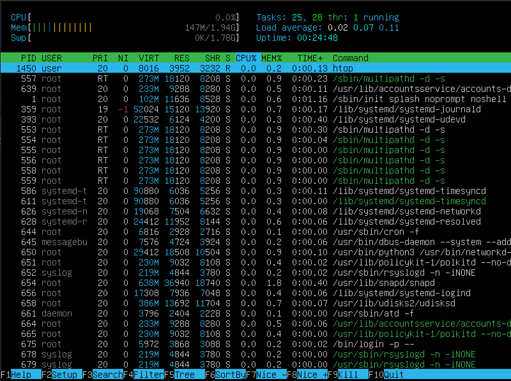
  - отсортированное по PERCENT_MEM:
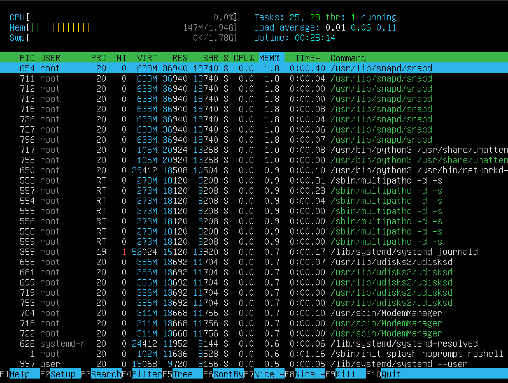
  - отсортированное по TIME:
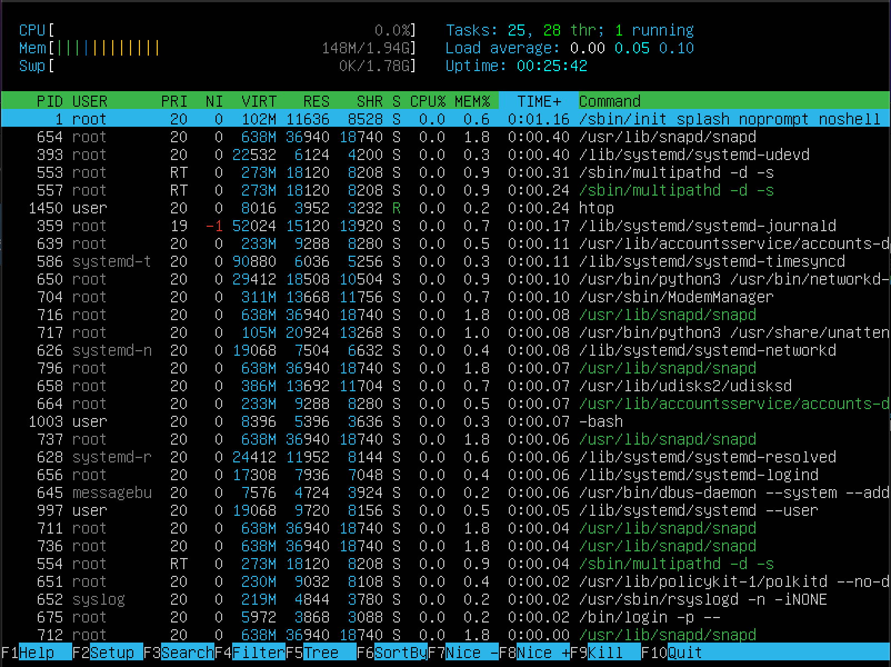
  - отфильтрованное для процесса sshd:
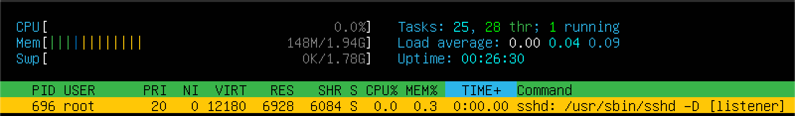
  - с процессом syslog, найденным, используя поиск:
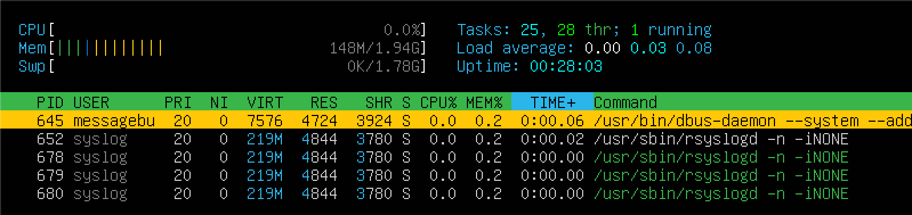
  - с добавленным выводом hostname, clock и uptime:
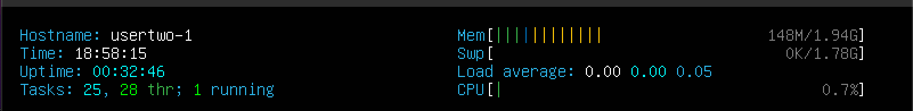

## Part 10. Использование утилиты **fdisk**

- Запустим команду `fdisk -l`.
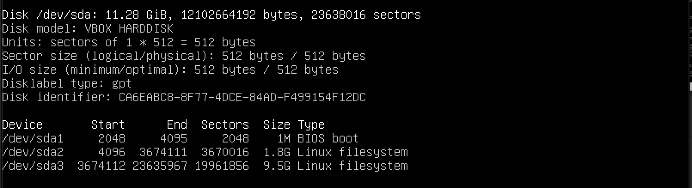
    - название диска: `VBOX HARDDISK`
    - размер: `11.28GB`
    - кол-во секторов: `23638016`
    - размер swap выведем командой `swapon --show`: 
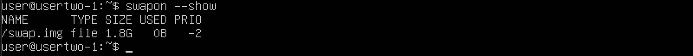

## Part 11. Использование утилиты **df** 

- Запустим команду `df`:
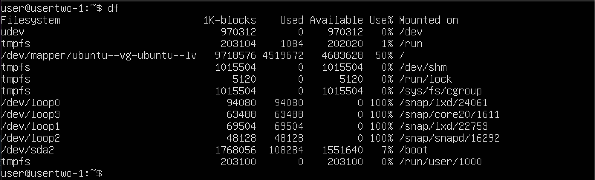
- для корневого раздела (/):
    - размер раздела: `9718576 кб`
    - размер занятого пространства: `4519672 кб`
    - размер свободного пространства: `4683628 кб`
    - процент использования: `50%`

- Запустим команду `df -Th`:
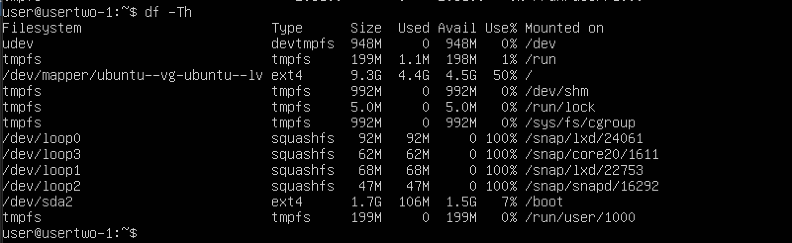
для корневого раздела (/):
    - размер раздела: `9.3 Гб`
    - размер занятого пространства: `4.4 Гб`
    - размер свободного пространства: `4.5 Гб`
    - процент использования: `50%`
    - тип файловой системы для раздела: `ext4`

## Part 12. Использование утилиты **du**

- Запустим команду `du`:
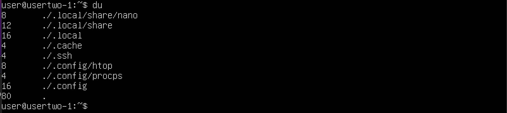

- Выведем размер папок /home, /var, /var/log (в байтах, в человекочитаемом виде): 
  - размер папки /home:

  - размер папки /var:

  - размер папки /var/log:

- Выведем размер всего содержимого в /var/log (не общее, а каждого вложенного элемента, используя *):
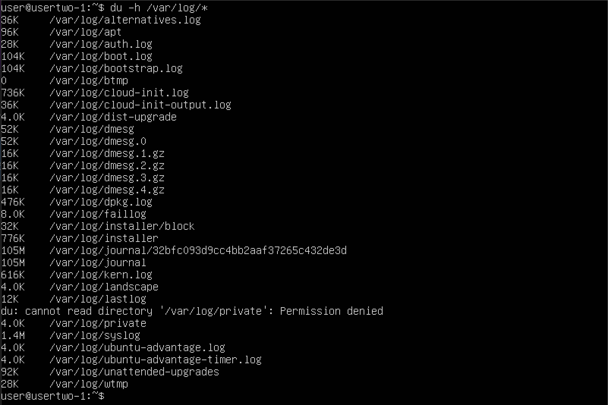

## Part 13. Установка и использование утилиты **ncdu**

- Установим утилиту `ncdu`:
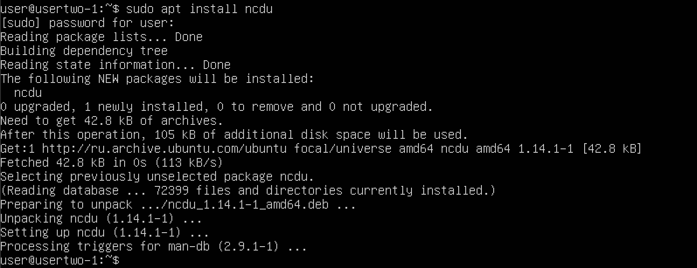

- Выведем размер папок /home, /var, /var/log:
    - Выведем размер папки /home:
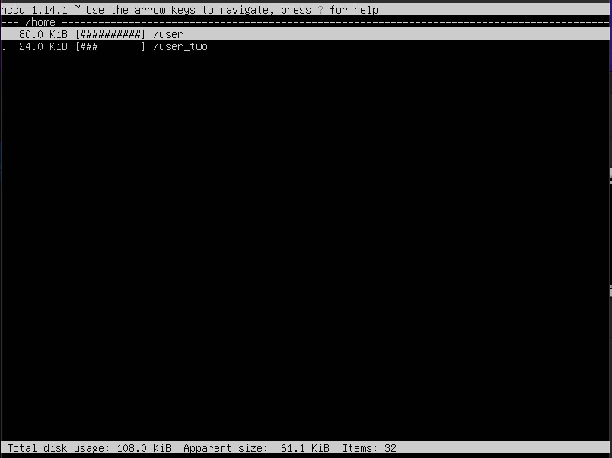
    - Выведем размер папки /var:
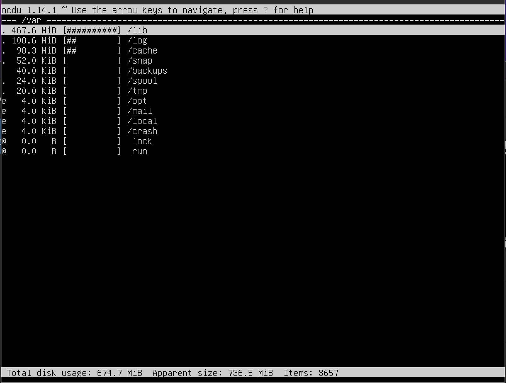  
    - Выведем размер папки /var/log:


## Part 14. Работа с системными журналами

- Откроем для просмотра:
  - /var/log/dmesg

  - /var/log/syslog

  - /var/log/auth.log 
 

- Узнаем время последней успешной авторизации, имя пользователя и метод входа в систему:

  - время последней успешной авторизации: Feb 16 14:19:40
  - имя пользователя: user
  - метод входа в систему: login
  
- Перезапустим службу SSHd:


- Cообщение о рестарте службы:


 ## Part 15. Использование планировщика заданий **CRON**

- Используя планировщик заданий, запустим команду uptime через каждые 2 минуты.
- Для начала внесем скрипт в планировщик командой `crontab -e`


- проверим выполнение команды `uptime` с интервалом 2 минуты: `tail /var/log/syslog | grep "CRON"`:

- Выведем на экран список текущих заданий для CRON командой `crontab -l`:


-  Удалим все задания из планировщика: `crontab -r`:
